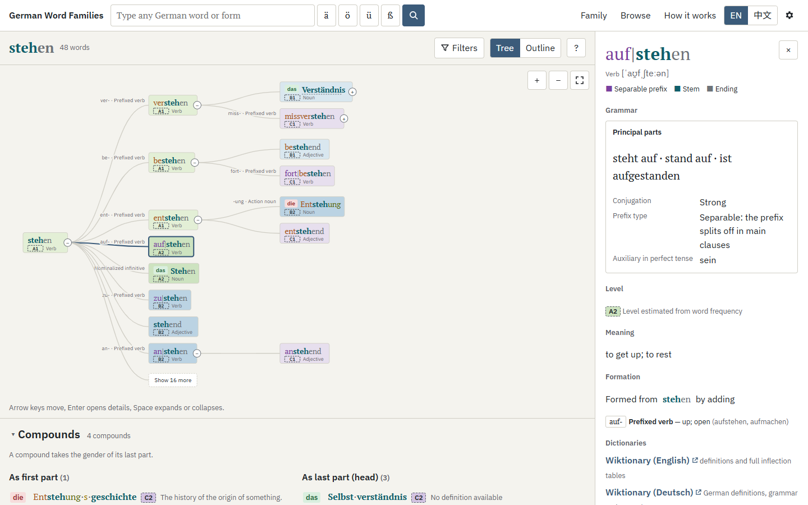
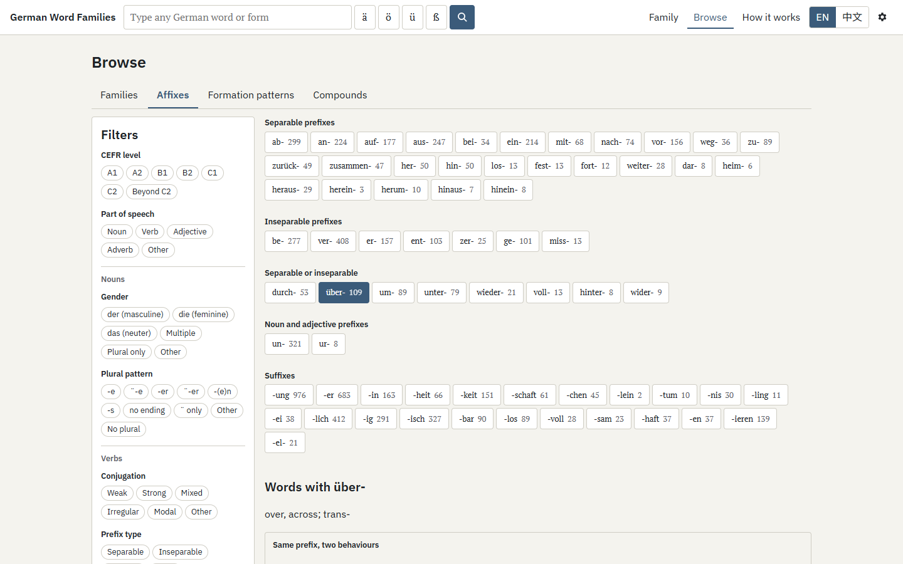
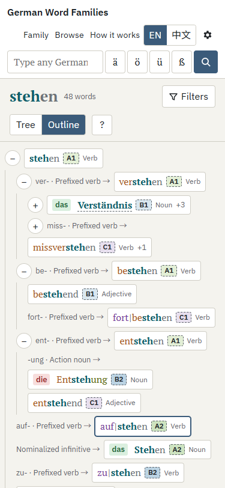

English | [繁體中文](README.zh-TW.md)

# German Word Families

Explore how German words are built: type any German word — in any form — and see its whole word family as a tree, with prefixes, suffixes, vowel changes and compounds.

[](https://github.com/trickster-2005/Deutsch-Learning-Tool/actions/workflows/deploy.yml)

## Live site

**<https://trickster-2005.github.io/Deutsch-Learning-Tool/>**

## Screenshots

| Family tree (`stehen`) | Browse: affixes | Phone (375 px) |
|---|---|---|
|  |  |  |

## Features

- **Search any form**: inflected forms (`Häuser`, `aufgestanden`), separated verbs (`stand auf`, `steht … auf`), `ä ö ü ß` buttons, autocomplete, and "Did you mean …?" for missing umlauts or `ss`/`ß` (`schon` → `schön`, `Strasse` → `Straße`).
- **Derivation tree**: each line is one derivation step, labelled with the added prefix/suffix, its formation type (`-ung · Action noun`), umlaut or ablaut, and part-of-speech changes. Zoom, pan, collapse, keyboard navigation; an outline view for small screens.
- **Morpheme colouring**: separable prefix, prefix, stem, suffix, ending and linking element each have a colour; separable verbs are shown as `auf|stehen`, compounds as `Arbeit·s·platz`.
- **Compound panel**: compounds that contain a family member as first part (`Haus·tür`) or as head (`Kranken·haus`), with linking elements highlighted.
- **Word details**: article, genitive and plural pattern for nouns; principal parts with auxiliary (`steht auf · stand auf · ist aufgestanden`), conjugation class, separability and reflexivity for verbs; comparative and superlative for adjectives; IPA, definitions, examples, topics, frequency. Same-spelling verbs such as `übersetzen` show both readings side by side.
- **External dictionaries**: every word links to Wiktionary, DWDS, Duden, LEO, Linguee and Forvo (pronunciation); in the Chinese interface to Chinese Wiktionary and LEO Chinese–German.
- **Filters** (all shareable in the URL): CEFR level, part of speech, gender, plural pattern, conjugation, prefix type, auxiliary, reflexive, formation type, part-of-speech change, vowel change, affix, topic, frequency, uncertain splits. Non-matching words can be dimmed, hidden, or the matches shown as a list.
- **My level**: words one level above yours get a bold outline and a "Next" tag; higher ones fade.
- **Colour by** level, part of speech or noun gender.
- **Browse**: all families (sortable, with level mini-bars), words by affix (with separable vs inseparable comparisons for `um-`, `über-` …), formation patterns (`wohnen → Wohnung`, all umlaut/ablaut pairs), and compounds by part or by linking element.
- **Bilingual interface**: English (default) and Traditional Chinese; German content is never translated.
- **Dark mode** (follows the system, or choose in ⚙).
- **Shareable URLs**: `#/family/f13040?focus=aufstehen&level=A1,A2&pos=VERB&mode=prune`.

## How it works

The site is fully static. All data is prepared offline by a Python pipeline and written as JSON files that the browser loads on demand.

```mermaid
flowchart LR
  A[download.py<br/>DErivBase · Wiktionary en/de/zh] --> B[Merge DErivBase trees<br/>with Wiktionary lexicon]
  B --> B2[Stitch split trees]
  B2 --> C[Frequency filter<br/>wordfreq]
  C --> D[Separable / inseparable]
  D --> E[Segmentation along<br/>derivation paths]
  E --> F[Compounds<br/>Wiktionary + CharSplit]
  F --> G[Edge annotation]
  G --> H[Estimated CEFR levels]
  H --> I[JSON in web/public/data]
  I --> J[Static site<br/>GitHub Pages]
```



**Derivation trees.** The skeleton comes from [DErivBase](https://www.ims.uni-stuttgart.de/forschung/ressourcen/lexika/derivbase/) in its Universal Derivations 1.1 form, where every family is a rooted tree. The harmonisation split many families into small pieces (`Aufstehen → aufstehen` lives apart from `stehen`), so the pipeline reconnects them with conservative rules: nominalized infinitives are placed below their verb, a verb `prefix + V` is attached to `V`, `un-` words to their base, remaining roots via Wiktionary etymology templates (`{{af|de|Haus|-chen}}`), and stem-noun / deadjectival conversions (`laufen ↔ Lauf`, `offen → öffnen`). DErivBase edges that are really compounds (`Haus → Haupthaus`) are cut and handled as compounds. Every rule and its reason is listed in [DECISIONS.md](DECISIONS.md).

**Lexicon.** Grammar comes first from German Wiktionary (gender via the article of the nominative singular, plurals, conjugation tables, auxiliaries), definitions and examples from English Wiktionary, and Chinese definitions from Chinese Wiktionary (converted to Traditional Chinese with OpenCC `s2twp`). All three are read from [Wiktextract](https://github.com/tatuylonen/wiktextract) dumps on kaikki.org.

**Segmentation along derivation paths.** There is no good open morpheme segmenter for German, so segmentation is derived from the tree. Root verbs lose their infinitive ending (`lächel+n`, `geh+en`); nouns and adjectives are one stem. Each child is matched as `PREFIX* + stem' + SUFFIX* + END` against its parent's stem, where `stem'` may be identical, lose a final `-e` (`Schule → schul-isch`), take an umlaut (`kaufen → Käuf-er`, confidence 0.9) or show ablaut, detected by an identical consonant skeleton (`springen → Sprung`, 0.8). If that fails, Wiktionary's `{{af}}`/`{{prefix}}`/`{{suffix}}` templates are tried (0.9); otherwise the word stays unsplit and is marked uncertain (0.3, shown with a dashed underline).

**Separable verbs.** In order: manual overrides; conflicting Wiktionary readings (→ two entries, `übersetzen#sep` / `übersetzen#insep`); finite forms that split off a particle (`steht auf`); the past participle (`auf-ge-standen` vs `übersetzt`); finally the prefix lists — only when the rest of the word is itself a verb, so `beten` is not read as `be-ten`.

**Compounds.** For kept nouns and adjectives: overrides, then English Wiktionary `{{compound}}`/`{{af}}` templates, then [CharSplit](https://github.com/dtuggener/CharSplit)'s best split if its score is ≥ 0.5, both parts exist as lemmas and the first part has ≥ 3 letters (one recursive split of the first part). Linking elements (`-s-`, `-n-`, `-er-`, `-es-`, `-e-`, `-ns-`, `-ens-`), elided `-e` (`Schul·bus`) and umlaut + `er` (`Hühner·ei`) are detected by comparing each part's lemma with its surface string.

**Levels.** German has no openly licensed CEFR word list, so levels are *estimated*. A lemma's frequency is the sum of the [wordfreq](https://github.com/rspeer/wordfreq) frequencies of all its forms. Because wordfreq ignores case, a form shared by several lemmas (`haus` is also an imperative of *hausen*) is split between them in proportion to each lemma's unambiguous evidence. Kept lemmas (Zipf ≥ 3.0) are ranked, and cumulative rank cut-offs give A1 ≤ 650, A2 ≤ 1300, B1 ≤ 2400, B2 ≤ 5000, C1 ≤ 10000, C2 ≤ 20000, then "beyond C2".

**Separable-verb frequency correction.** Separated occurrences (`steht … auf`) cannot be counted in a word-frequency list, so separable verbs get their contiguous-form frequency × 2.5 (`separable_boost`). This is a heuristic.

**Why a static site?** No server to run or pay for, it works from GitHub Pages, it is fast (each family is one small JSON file), and nothing a user types leaves the browser.

## Data sources & licenses

| Name | Used for | License | Link |
|---|---|---|---|
| DErivBase (UDer 1.1) | family trees | CC BY-SA 3.0 | [LINDAT](https://lindat.mff.cuni.cz/repository/xmlui/handle/11234/1-3247) |
| English Wiktionary | definitions, examples, forms, etymology | CC BY-SA / GFDL | [kaikki.org](https://kaikki.org/dictionary/) |
| German Wiktionary | grammar, IPA, forms | CC BY-SA / GFDL | [kaikki.org](https://kaikki.org/dewiktionary/) |
| Chinese Wiktionary | Chinese definitions | CC BY-SA / GFDL | [kaikki.org](https://kaikki.org/zhwiktionary/) |
| CharSplit | compound splitting | MIT | [GitHub](https://github.com/dtuggener/CharSplit) |
| wordfreq | frequencies and levels | CC BY-SA 4.0 | [GitHub](https://github.com/rspeer/wordfreq) |

Details and full credits: [LICENSES.md](LICENSES.md). The license assessment is an engineering judgement, not legal advice.

## Local development

Requirements: Python 3.11+, [uv](https://docs.astral.sh/uv/), Node 20+.

```bash
# build the data (downloads ~700 MB once into build/.cache/, then ~5 min)
cd build && uv sync && uv run python download.py && uv run python pipeline.py

# run the site
cd web && npm ci && npm run dev

# tests
cd build && uv run pytest
cd web && npm test
```

- Downloads: UDer 1.1 (68 MB), English Wiktionary German slice (98 MB; the 3 GB raw dump is the fallback), German Wiktionary (310 MB), Chinese Wiktionary (230 MB). Filtered German entries (~4 GB of JSONL) and parsed caches (`lex_*.pkl`) stay in `build/.cache/` (git-ignored). A first run needs roughly 10–30 minutes depending on the connection; later runs about 3–5 minutes.
- Reports are written to `build/reports/` (`summary.md`, `spot_checks.md`, `affix_unmatched.csv`, `separability_unknown.csv`, `compound_rejects.csv`).
- README screenshots: `cd web && npm run build && npx vite preview --port 4173` then `node scripts/screenshots.mjs` (uses Playwright with Edge/Chrome).

## Project structure

```
build/                 offline data pipeline (Python)
  adapters/            one adapter per source: derivbase, wiktionary, compounds, segmenter,
                       frequency, levels, topics, stitch (tree repair), text helpers
  curated/             hand-made tables: affixes, particles, topics, overrides
  config.yaml          thresholds and cut-offs
  download.py          downloads and filters the sources into build/.cache/
  pipeline.py          steps 7.1–7.10: merge, filter, segment, compounds, levels
  export.py            writes web/public/data/ and build/reports/
  tests/               pytest
web/                   static site (Vite + React + TypeScript)
  public/data/         generated JSON (committed)
  src/lib/             data loading, search, filters, levels, family model
  src/components/      tree (D3), outline, detail panel, filters, legend …
  src/pages/           Home, Family, Browse, How it works
  src/i18n/            en.json, zh-Hant.json (generated by scripts/strings.py)
.github/workflows/     GitHub Pages deployment
docs/screenshots/      README images
DECISIONS.md           every decision not fixed by the spec, with reasons
LICENSES.md            sources, licenses, citations
```

## Rebuilding & deploying

1. Run the pipeline (see above); it overwrites `web/public/data/`.
2. Commit `web/public/data/` together with any code changes and push to `main`.
3. The workflow `.github/workflows/deploy.yml` runs the frontend tests, builds `web/` and publishes `web/dist` to GitHub Pages.

One-time GitHub setup: **Settings → Pages → Build and deployment → Source: GitHub Actions.**

## Customization

`build/config.yaml`:

| key | default | meaning |
|---|---|---|
| `min_zipf` | 3.0 | keep lemmas with at least this Zipf frequency |
| `separable_boost` | 2.5 | frequency multiplier for separable verbs |
| `stars` | 5.0 / 4.5 / 4.0 / 3.5 | Zipf thresholds for 5 … 2 stars |
| `cefr_cutoffs` | 650 / 1300 / 2400 / 5000 / 10000 / 20000 | cumulative ranks for A1 … C2 |
| `gloss_max_chars`, `example_max_chars`, `max_examples`, `max_senses` | 80, 120, 2, 2 | definition and example limits |
| `charsplit_min_score`, `charsplit_min_modifier_len` | 0.5, 3 | CharSplit acceptance |

`build/curated/`:

- `affixes.yaml` — prefixes (kind, variants, meanings in English and Chinese, examples) and suffixes (input/output POS, gender, formation type).
- `particles.yaml` — separable, inseparable and dual verb prefixes.
- `topics.yaml` — Wiktionary category keywords → topics.
- `overrides.yaml` — manual fixes that always win: `segmentation`, `separable`, `compound`, `gloss_en`, `gloss_zh`, `unlink` (cut a wrong derivation link), `not_compound`.
- `levels_custom.csv` (optional, not included) — columns `lemma,pos,level`. If present, the build writes `levels/custom.json` and the site offers a "Custom list" level source. This file and its output are git-ignored: make sure you have the right to use and publish the list.

## Known limitations

- Everything is generated automatically; some derivation links, splits and definitions are wrong. Uncertain splits are marked.
- Levels are estimates from frequency, not an official CEFR list. Case-insensitive frequencies blur words like `Essen`/`essen`.
- DErivBase contains no compounds, so compounds are detected separately (Wiktionary, CharSplit) and may be missed or over-split.
- DErivBase links some etymologically unrelated words (e.g. `freuen → Freund`), and the stitching rules can join words that only look related.
- About 30 % of words have no Chinese definition; English is shown instead.
- The separable-verb frequency correction is a heuristic.

## Contributing

- Report errors: [GitHub Issues](https://github.com/trickster-2005/Deutsch-Learning-Tool/issues).
- Fix data: edit `build/curated/overrides.yaml` (for example `unlink: [[freuen, freund]]` or `gloss_zh: {aufstehen: "起床"}`), rebuild with `uv run python pipeline.py` and open a pull request with the regenerated `web/public/data/`.

## Credits & citations

- Zeller, Britta; Šnajder, Jan; Padó, Sebastian (2013). *DErivBase: Inducing and Evaluating a Derivational Morphology Resource for German.* Proceedings of ACL 2013, pp. 1201–1211.
- Kyjánek, Lukáš; Žabokrtský, Zdeněk; Ševčíková, Magda; Vidra, Jonáš (2020). *Universal Derivations 1.0, A Growing Collection of Harmonised Word-Formation Resources.* The Prague Bulletin of Mathematical Linguistics 115, pp. 5–30.
- Ylonen, Tatu (2022). *Wiktextract: Wiktionary as Machine-Readable Structured Data.* Proceedings of LREC 2022, pp. 1317–1325.
- Tuggener, Don (2016). *Incremental Coreference Resolution for German.* PhD thesis, University of Zurich. (CharSplit)
- Speer, Robyn (2022). *rspeer/wordfreq: v3.0.* Zenodo. doi:10.5281/zenodo.7199437.

## License

Code: MIT. Data (`web/public/data/`): CC BY-SA 4.0. See [LICENSES.md](LICENSES.md).
