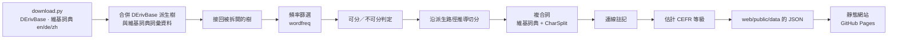

[English](README.md) | 繁體中文

# 德文詞族（German Word Families）

看懂德文單字是怎麼組成的：輸入任何德文單字（任何變化形都可以），就能看到它所屬的整個詞族樹，包括前綴、後綴、母音變化與複合詞。

[](https://github.com/trickster-2005/Deutsch-Learning-Tool/actions/workflows/deploy.yml)

## 線上網站

**<https://trickster-2005.github.io/Deutsch-Learning-Tool/>**

## 截圖

| 詞族樹（`stehen`） | 瀏覽：詞綴 | 手機（375 px） |
|---|---|---|
|  |  |  |

## 功能

- **任何形式都能搜尋**：變化形（`Häuser`、`aufgestanden`）、分離的可分動詞（`stand auf`、`steht … auf`）、`ä ö ü ß` 輸入按鈕、自動完成，以及少打變音或把 `ß` 寫成 `ss` 時的「您是不是要找……？」（`schon` → `schön`、`Strasse` → `Straße`）。
- **派生樹**：每條線代表一次派生，標示加上的前綴／後綴、構詞類型（`-ung · 動作名詞`）、變音或母音交替，以及詞性轉換。可縮放、平移、收合，也能用鍵盤操作；小螢幕上改用大綱檢視。
- **詞素上色**：可分前綴、前綴、詞幹、後綴、詞尾、連接成分各有顏色；可分動詞顯示為 `auf|stehen`，複合詞顯示為 `Arbeit·s·platz`。
- **複合詞面板**：列出以詞族成員為前項（`Haus·tür`）或中心詞（`Kranken·haus`）的複合詞，並標出連接成分。
- **單字詳細資訊**：名詞的冠詞、屬格與複數類型；動詞的主要形式與助動詞（`steht auf · stand auf · ist aufgestanden`）、變位類型、可分性、反身；形容詞的比較級與最高級；另有國際音標、釋義、例句、主題、常用程度。同形不同義的動詞（如 `übersetzen`）會並列兩種用法。
- **篩選**（全部寫在網址中，可分享）：CEFR 等級、詞性、名詞性別、複數類型、變位類型、前綴類型、助動詞、反身、構詞類型、詞性轉換、母音變化、詞綴、主題、常用程度、隱藏不確定的切分。不符合的詞可以淡化、隱藏，或把符合的詞改成清單顯示。
- **我的程度**：比你的程度高一級的詞會加上粗外框與「下一步」標記，更難的詞則淡化。
- **著色依據**：等級、詞性或名詞性別。
- **瀏覽頁**：所有詞族（可排序，附等級分布迷你條）、依詞綴列出單字（`um-`、`über-` 等雙重前綴會並列可分與不可分的例子）、構詞規律（`wohnen → Wohnung`、所有變音／母音交替配對），以及依部件或連接成分查詢複合詞。
- **雙語介面**：英文（預設）與繁體中文；德文內容一律不翻譯。
- **深色模式**（跟隨系統，或在 ⚙ 中切換）。
- **可分享的網址**：`#/family/f13040?focus=aufstehen&level=A1,A2&pos=VERB&mode=prune`。

## 運作原理

這是一個純靜態網站。所有資料都由 Python 建置流程離線處理，輸出成 JSON 檔，瀏覽器需要時才載入。



**派生樹。** 骨架來自 Universal Derivations 1.1 版本的 [DErivBase](https://www.ims.uni-stuttgart.de/forschung/ressourcen/lexika/derivbase/)，每個詞族都是一棵有根的樹。不過協調過程把許多詞族拆成了小塊（`Aufstehen → aufstehen` 與 `stehen` 分開），所以建置流程用保守的規則把它們接回去：不定式名詞化的名詞放到動詞底下；「前綴 + V」的動詞接到 `V` 底下；`un-` 開頭的詞接到基礎詞；其餘的樹根依維基詞典的詞源模板（`{{af|de|Haus|-chen}}`）連接；再處理詞幹名詞與形容詞轉動詞的轉換（`laufen ↔ Lauf`、`offen → öffnen`）。DErivBase 中其實是複合詞的連線（`Haus → Haupthaus`）會被切斷，改當作複合詞處理。每條規則與理由都寫在 [DECISIONS.md](DECISIONS.md)。

**詞彙資料。** 文法資訊優先取自德文維基詞典（以主格單數的冠詞判斷性別、複數、變位表、助動詞），釋義與例句取自英文維基詞典，中文釋義取自中文維基詞典（以 OpenCC `s2twp` 轉為繁體）。三者都讀取 kaikki.org 上的 [Wiktextract](https://github.com/tatuylonen/wiktextract) 資料。

**沿派生路徑推導切分。** 德文沒有好用的開放詞素切分工具，所以切分由派生樹推導而來。樹根動詞去掉不定式詞尾（`lächel+n`、`geh+en`），名詞與形容詞整個是詞幹。每個子節點依 `前綴* + 詞幹' + 後綴* + 詞尾` 的形式與父節點的詞幹比對，其中詞幹' 可以完全相同、少了結尾 `-e`（`Schule → schul-isch`）、變音（`kaufen → Käuf-er`，信心度 0.9），或母音交替：子音骨架相同即視為交替（`springen → Sprung`，0.8）。比對失敗時改用維基詞典的 `{{af}}`／`{{prefix}}`／`{{suffix}}` 模板（0.9）；再失敗就不切分，標記為不確定（0.3，以虛線底線顯示）。

**可分動詞。** 判定順序：人工覆寫；維基詞典有兩種互相衝突的用法（→ 分成 `übersetzen#sep` 與 `übersetzen#insep` 兩筆）；現在式或過去式有分離的前綴（`steht auf`）；過去分詞（`auf-ge-standen` 與 `übersetzt`）；最後才看前綴清單，而且只有在剩下的部分本身也是動詞時才採用，所以 `beten` 不會被誤判為 `be-ten`。

**複合詞。** 對保留的名詞與形容詞依序嘗試：人工覆寫、英文維基詞典的 `{{compound}}`／`{{af}}` 模板，最後是 [CharSplit](https://github.com/dtuggener/CharSplit) 的最佳切分，但分數須 ≥ 0.5、兩個部件都要是已知原形、前項至少 3 個字母（前項可再遞迴切分一次）。連接成分（`-s-`、`-n-`、`-er-`、`-es-`、`-e-`、`-ns-`、`-ens-`）、省略的 `-e`（`Schul·bus`）與變音加 `er`（`Hühner·ei`）是比較部件原形與實際字串後判斷的。

**等級。** 德文沒有開放授權的 CEFR 詞表，所以等級一律是**估計值**。原形的頻率是其所有變化形在 [wordfreq](https://github.com/rspeer/wordfreq) 中頻率的總和。由於 wordfreq 不分大小寫，同一個形式可能屬於好幾個原形（`haus` 也是 *hausen* 的命令式），這時依各原形「不會混淆的證據」多寡按比例分配。保留的原形（Zipf ≥ 3.0）依頻率排名，以累積排名切分：A1 ≤ 650、A2 ≤ 1300、B1 ≤ 2400、B2 ≤ 5000、C1 ≤ 10000、C2 ≤ 20000，其餘為「超出分級」。

**可分動詞的頻率修正。** 詞頻表無法計算分開出現的形式（`steht … auf`），因此可分動詞的頻率為連寫形式的頻率 × 2.5（`separable_boost`）。這是啟發式的做法。

**為什麼是純靜態網站？** 不需要架設或付費維護伺服器，可以直接放在 GitHub Pages；速度快（每個詞族只是一個小 JSON 檔）；而且使用者輸入的內容不會離開瀏覽器。

## 資料來源與授權

| 名稱 | 用途 | 授權 | 連結 |
|---|---|---|---|
| DErivBase（UDer 1.1） | 詞族樹 | CC BY-SA 3.0 | [LINDAT](https://lindat.mff.cuni.cz/repository/xmlui/handle/11234/1-3247) |
| 英文維基詞典 | 釋義、例句、詞形、詞源 | CC BY-SA / GFDL | [kaikki.org](https://kaikki.org/dictionary/) |
| 德文維基詞典 | 文法、國際音標、詞形 | CC BY-SA / GFDL | [kaikki.org](https://kaikki.org/dewiktionary/) |
| 中文維基詞典 | 中文釋義 | CC BY-SA / GFDL | [kaikki.org](https://kaikki.org/zhwiktionary/) |
| CharSplit | 複合詞切分 | MIT | [GitHub](https://github.com/dtuggener/CharSplit) |
| wordfreq | 詞頻與等級 | CC BY-SA 4.0 | [GitHub](https://github.com/rspeer/wordfreq) |

詳細說明與完整出處請見 [LICENSES.md](LICENSES.md)。授權說明是工程上的判斷，不構成法律意見。

## 本機開發

需求：Python 3.11+、[uv](https://docs.astral.sh/uv/)、Node 20+。

```bash
# 建置資料（第一次會下載約 700 MB 到 build/.cache/，之後約 5 分鐘）
cd build && uv sync && uv run python download.py && uv run python pipeline.py

# 執行網站
cd web && npm ci && npm run dev

# 測試
cd build && uv run pytest
cd web && npm test
```

- 下載內容：UDer 1.1（68 MB）、英文維基詞典的德文部分（98 MB；3 GB 的完整資料為後備來源）、德文維基詞典（310 MB）、中文維基詞典（230 MB）。篩選後的德文條目（約 4 GB 的 JSONL）與解析快取（`lex_*.pkl`）都放在 `build/.cache/`（已加入 git 忽略）。第一次執行視網路速度約需 10–30 分鐘，之後每次約 3–5 分鐘。
- 建置報告輸出到 `build/reports/`（`summary.md`、`spot_checks.md`、`affix_unmatched.csv`、`separability_unknown.csv`、`compound_rejects.csv`）。
- README 截圖：`cd web && npm run build && npx vite preview --port 4173`，再執行 `node scripts/screenshots.mjs`（使用 Playwright 搭配 Edge／Chrome）。

## 專案結構

```
build/                 離線資料建置流程（Python）
  adapters/            每個資料來源一個 adapter：derivbase、wiktionary、compounds、segmenter、
                       frequency、levels、topics、stitch（接回派生樹）、文字工具
  curated/             人工整理的表：詞綴、前綴、主題、覆寫
  config.yaml          門檻與切點
  download.py          下載並篩選資料到 build/.cache/
  pipeline.py          步驟 7.1–7.10：合併、篩選、切分、複合詞、等級
  export.py            輸出 web/public/data/ 與 build/reports/
  tests/               pytest
web/                   靜態網站（Vite + React + TypeScript）
  public/data/         產生的 JSON（提交到 git）
  src/lib/             資料載入、搜尋、篩選、等級、詞族模型
  src/components/      樹狀圖（D3）、大綱、詳細面板、篩選、圖例……
  src/pages/           首頁、詞族、瀏覽、使用說明
  src/i18n/            en.json、zh-Hant.json（由 scripts/strings.py 產生）
.github/workflows/     GitHub Pages 部署
docs/screenshots/      README 用圖
DECISIONS.md           規格沒寫到的決定與理由
LICENSES.md            資料來源、授權、引用
```

## 重新建置與部署

1. 執行建置流程（見上方），會覆寫 `web/public/data/`。
2. 把 `web/public/data/` 與程式碼變更一起提交，推送到 `main`。
3. `.github/workflows/deploy.yml` 會執行前端測試、建置 `web/`，並把 `web/dist` 發布到 GitHub Pages。

GitHub 只需設定一次：**Settings → Pages → Build and deployment → Source 選 GitHub Actions。**

## 自訂

`build/config.yaml`：

| 參數 | 預設值 | 說明 |
|---|---|---|
| `min_zipf` | 3.0 | 保留 Zipf 頻率至少為此值的原形 |
| `separable_boost` | 2.5 | 可分動詞的頻率倍數 |
| `stars` | 5.0 / 4.5 / 4.0 / 3.5 | 5 到 2 顆星的 Zipf 門檻 |
| `cefr_cutoffs` | 650 / 1300 / 2400 / 5000 / 10000 / 20000 | A1 到 C2 的累積排名 |
| `gloss_max_chars`、`example_max_chars`、`max_examples`、`max_senses` | 80、120、2、2 | 釋義與例句的長度與數量上限 |
| `charsplit_min_score`、`charsplit_min_modifier_len` | 0.5、3 | CharSplit 的接受條件 |

`build/curated/`：

- `affixes.yaml`：前綴（類型、變體、中英文意義、例子）與後綴（輸入／輸出詞性、性別、構詞類型）。
- `particles.yaml`：可分、不可分與雙重動詞前綴。
- `topics.yaml`：維基詞典分類關鍵字 → 主題。
- `overrides.yaml`：一律優先的人工修正：`segmentation`、`separable`、`compound`、`gloss_en`、`gloss_zh`、`unlink`（切斷錯誤的派生連線）、`not_compound`。
- `levels_custom.csv`（選用，預設不存在）：欄位為 `lemma,pos,level`。若檔案存在，建置時會產生 `levels/custom.json`，網站的「分級依據」會多出「自訂詞表」。此檔案與其產出都不會提交到 git：請自行確認你有權使用並公開該詞表。

## 已知限制

- 所有內容皆為自動產生，部分派生連線、切分與釋義可能有誤；不確定的切分會標示出來。
- 等級是依頻率估計的，不是官方 CEFR 詞表；頻率不分大小寫，所以像 `Essen`／`essen` 這類詞的頻率會混在一起。
- DErivBase 不含複合詞，因此複合詞另外判斷（維基詞典、CharSplit），可能漏判或切得太細。
- DErivBase 會把一些詞源上無關的詞連在一起（例如 `freuen → Freund`），接回派生樹的規則也可能連接只是看起來相關的詞。
- 約 30% 的詞沒有中文釋義，會改顯示英文。
- 可分動詞的頻率修正是啟發式做法。

## 貢獻

- 回報錯誤：[GitHub Issues](https://github.com/trickster-2005/Deutsch-Learning-Tool/issues)。
- 修正資料：編輯 `build/curated/overrides.yaml`（例如 `unlink: [[freuen, freund]]` 或 `gloss_zh: {aufstehen: "起床"}`），用 `uv run python pipeline.py` 重新建置，再連同重新產生的 `web/public/data/` 送出 pull request。

## 致謝與引用

- Zeller, Britta; Šnajder, Jan; Padó, Sebastian (2013). *DErivBase: Inducing and Evaluating a Derivational Morphology Resource for German.* Proceedings of ACL 2013, pp. 1201–1211.
- Kyjánek, Lukáš; Žabokrtský, Zdeněk; Ševčíková, Magda; Vidra, Jonáš (2020). *Universal Derivations 1.0, A Growing Collection of Harmonised Word-Formation Resources.* The Prague Bulletin of Mathematical Linguistics 115, pp. 5–30.
- Ylonen, Tatu (2022). *Wiktextract: Wiktionary as Machine-Readable Structured Data.* Proceedings of LREC 2022, pp. 1317–1325.
- Tuggener, Don (2016). *Incremental Coreference Resolution for German.* PhD thesis, University of Zurich.（CharSplit）
- Speer, Robyn (2022). *rspeer/wordfreq: v3.0.* Zenodo. doi:10.5281/zenodo.7199437.

## 授權

程式碼：MIT。資料（`web/public/data/`）：CC BY-SA 4.0。詳見 [LICENSES.md](LICENSES.md)。
